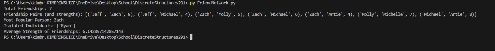

# CS-291-FriendshipNetwork
 Using graph theory, create a visual representation and analysis of a simulated friendship network. 

#### References:
[NumPy](https://numpy.org/doc/stable/reference/generated/numpy.matrix.html)

[NetworkX](https://networkx.org/documentation/stable/tutorial.html)

[Matplotlib](https://matplotlib.org/stable/api/_as_gen/matplotlib.pyplot.plot.html)

## Overview 
This Python program analyzes a predefined network of friendships represented by a matrix using Python libraries such as NumPy, NetworkX, and Matplotlib. It calculates various network metrics, visualizes the friendship network graphically, and provides insights into social dynamics such as connectivity, popularity, and isolation within the network.

## Setup
To run this program, follow these steps:
1. Install Python: Ensure that Python 3.6 or higher is installed on your system. You can download it from [Python's official website](https://www.python.org/downloads/)
2. Install Required Libraries: Open your terminal or command prompt and install the requried Python libraries by running:
   pip install numpy networkx matplotlib
3. Download the Script: Down the "FriendNetwork.py" script to your local machine.
4. Run the Script: Open your terminal or command prompt, navigate to the directory containing the script, and run:
   py FriendNetwork.py

### Dependencies: 
- NumPy: Used for managing data in a matrix format.
- NetworkX: Utilized to transform the matrix into a graph and to calculate various network-related metrics.
- Matplotlib: Helps in visualizing the friendship netowrk as a graph.

## Output 

Output text: 
Total Friendships: 7
Friendship Pairs (and strengths): [('Jeff', 'Zach', 9), ('Jeff', 'Michael', 4), ('Zach', 'Molly', 5), ('Zach', 'Michael', 6), ('Zach', 'Artie', 4), ('Molly', 'Michelle', 7), ('Michael', 'Artie', 8)]
Most Popular Person: Zach
Isolated Individuals: ['Ryan']
Average Strength of Friendships: 6.14

